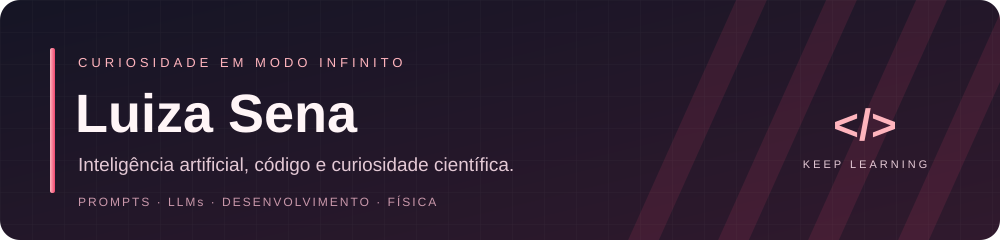
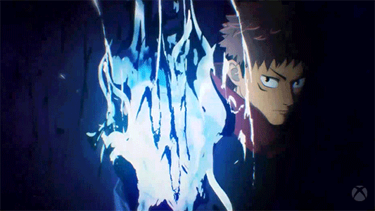

<h3></h3>

Entre modelos de linguagem, linhas de código e perguntas sobre o universo.

Energia de Itadori para aprender, criar e encarar o próximo desafio. 🥊

## 

Sou **engenheira de prompts e treinadora de IA**, com experiência em avaliação de respostas de grandes modelos de linguagem, anotação de dados e documentação de fluxos técnicos. Gosto de aproximar **tecnologia, pensamento científico e necessidades reais**.

- 🧠 Trabalho com criação e teste de prompts, qualidade de respostas e análise de possíveis vieses em IA.
- 💻 Desenvolvo aplicações web e exploro **IA local com foco em privacidade**.
- 🔬 Curso **Ciência da Computação, Inteligência Artificial e Aprendizado de Máquina e Física**.
- 🌌 Tenho interesse em IA para descoberta científica, física computacional e computação quântica.
- ☕ Por aqui, ciência e código dividem espaço com café, animes e vontade de aprender.

 

## 

  
  
  
  
  
  
  

| Área | O que faço e estudo |
| :--- | :--- |
| **IA e dados** | Engenharia de prompts, avaliação e alinhamento de LLMs, anotação de dados e revisão de respostas |
| **IA local e privacidade** | LM Studio, aplicações executadas em hardware pessoal e tratamento responsável de dados |
| **Desenvolvimento** | Python, JavaScript, HTML, CSS, Git, GitHub e linha de comando Linux |
| **Em aprendizado** | Machine learning, fundamentos de cibersegurança e a interseção entre IA e ciências físicas |

## 

| Projeto | O que você vai encontrar |
| :--- | :--- |
| **[Betelgeuse A.I.](https://github.com/luizasenacafe/Aurora_AI)** | Aplicação de IA local e privada que conecta modelos baixados no LM Studio e permite executá-los no computador ou em um servidor próprio, mantendo prompts e conversas sob o controle de quem usa. |
| **[Random Animes](https://luizasenacafe.github.io/random_animes/)** | Aplicação web para descobrir animes e mangás, com filtros por gênero e modos de navegação separados. |
| **[Meu portfólio](https://luizasenacafe.github.io/)** | Um ponto de encontro para meus projetos, competências, certificações e trajetória profissional. |

## 

Minha formação conecta três perspectivas: construir sistemas, compreender inteligência artificial e investigar o mundo físico.

- **Ciência da Computação** — UNINTER · em andamento, conclusão prevista em 2030.
- **Inteligência Artificial e Aprendizado de Máquina** — UNIASSELVI · em andamento, conclusão prevista no 1º semestre de 2029.
- **Física (Licenciatura)** — Unicesumar · em andamento, conclusão prevista no 2º semestre de 2030.

<strong>📜 Experiências e certificações</strong>

### 

- **Outlier AI · Engenheira de Prompts** — desde abril de 2026. Criação, teste e avaliação de prompts, revisão de respostas e documentação de critérios de avaliação.
- **RWS Group · Analista de Dados e Treinadora de IA** — 2025–2026. Anotação de dados, avaliação de qualidade e possíveis vieses, além de feedback para treinamento de modelos.
- **Desenvolvimento web freelancer** — 2024–2025. Planejamento, desenvolvimento e publicação de um site profissional responsivo para uma profissional de Psicologia.

### 

- **AI Specialist · Santander Digital Immersion** — Alura, FIAP, PM3 e StartSe · 107 horas.
- **Introdução à Cibersegurança** — Cisco Networking Academy.
- **Python: Programação Orientada a Objetos para Iniciantes** — UNINTER · 20 horas.
- **Letramento Digital: Introdução Profissional** — SENAI-MG · 40 horas.

**Idiomas:** português nativo · inglês intermediário · espanhol básico.

## 

Meu histórico de contribuições em modo Galaga. Press start! 🚀

<picture>
  <source media="(prefers-color-scheme: dark)" srcset="https://raw.githubusercontent.com/luizasenacafe/luizasenacafe/pacman-output/galaga-contribution-graph-dark.svg">
  <source media="(prefers-color-scheme: light)" srcset="https://raw.githubusercontent.com/luizasenacafe/luizasenacafe/pacman-output/galaga-contribution-graph.svg">
  
</picture>

---

<h3></h3>

IA, ciência, desenvolvimento ou uma boa recomendação de anime.

<a href="https://www.linkedin.com/in/luiza-sena-5645913a7/">LinkedIn</a> ·
<a href="https://luizasenacafe.github.io/">Portfólio</a> ·
<a href="mailto:luiizan12@gmail.com">E-mail</a> ·
<a href="https://www.instagram.com/luiizafk/">Instagram</a>

Discord: <code>karlpuccinomarx</code>

🌸 Aprendendo um pouco mais a cada missão.

Créditos visuais

Itadori Yuji e os personagens de Jujutsu Kaisen pertencem aos seus respectivos titulares. GIFs usados para personalização de perfil de fã, sem afiliação oficial.

- [Itadori em ação — GIPHY](https://giphy.com/gifs/CCiCwrKIvodowJBbtf) · animação presente no perfil original.
- [Retrato de Itadori — Tenor](https://tenor.com/view/itadori-yuji-gif-21648123).
- [Itadori e o trio — Tenor](https://tenor.com/view/jujutsu-kaisen-itadori-yuji-gif-25285781).
- Ícones de tecnologia: [Devicon](https://devicon.dev/). Badges: [Shields.io](https://shields.io/).

